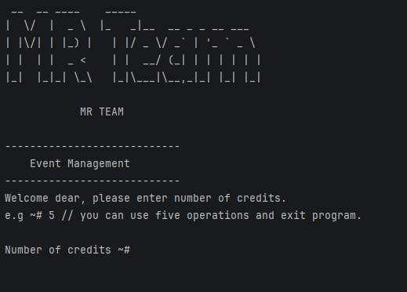
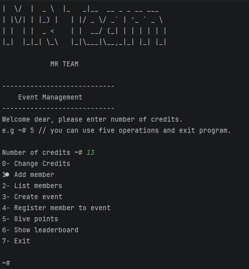

# Event Management – Campus Club Manager (`Console App`)

A simple ***Java console application*** designed to manage a university campus club.
The system allows managing members, events, and points using Object-Oriented Programming (OOP) principles.

This project was developed as part of a training assignment to demonstrate core Java concepts including control flow, OOP design, encapsulation, inheritance, polymorphism, and abstraction.

## 👥 Team Members

- Eng. Mohammad Asaad
- Eng. Rawan Medhat

## 📌 Project Overview

Campus Club Manager is a menu-driven console application that enables users to:

- Add and manage club members 
- Create and manage events 
- Register members to events 
- Award points based on participation 
- Display a leaderboard based on member performance

The application runs continuously until the user chooses to exit.

## 🎯 Project Goals

The main objective of this project is to:

- Build a Java console application using keyboard input.
- Store and manage data using objects.
- Apply decision-making and looping structures. 
- Demonstrate clean OOP design with proper separation of responsibilities.

## 📂 Project Structure

- App.java – Main entry point and menu handling
- Member.java – Base member class
- RegularMember.java – Standard member implementation
- OfficerMember.java – Extended member with extra privileges
- Event.java – Event entity and capacity management


## ⚙️ Core Features
### 1️⃣ Main Menu

The application starts with a menu-driven interface:
```markdown
1. Add member
2. List members
3. Create event
4. Register member to event
5. Give points
6. Show leaderboard
7. Exit
```

- Uses `Scanner` for user input. 
- Runs using loops until exit is selected.

### 2️⃣ Member Management

Each member contains:

- Unique ID
- Name
- Email
- Points

Validation rules:
- ID must be positive.
- Name cannot be empty.
- Email must contain `@`.
- Points start at 0.

Points are updated using controlled operations only.

### 3️⃣ Event Management

Each event contains:
- Event ID
- Title
- Capacity
- Type (Workshop / Competition)

Features:
- Events created using constructors.
- Registration is limited by event capacity.

### 4️⃣ Member Registration

The system allows:
- Selecting a member and an event.
- Registering members using loops and conditions.
- Preventing duplicate registrations.
- Displaying clear success or failure messages.

### 5️⃣ Points System

Points follow controlled rules:
- Points cannot be modified directly.
- Points are added through specific actions:
  - Attending an event
  - Winning a competition
- Negative points are prevented unless penalties are implemented.

### 6️⃣ Leaderboard

- Members are displayed in descending order by points.
- Implemented using simple sorting logic.

## 🧠 OOP Concepts Applied
### ✅ Encapsulation

- Member fields are private.
- Public getters are used for reading data.
- Points are updated through controlled methods only.

### ✅ Inheritance

Two member types are implemented:
- `RegularMember`
- `OfficerMember`

Officer members receive bonus points or special behavior.

### ✅ Polymorphism

Both member types are treated as the parent type when stored in collections, while maintaining their specific behaviors.

### ✅ Abstraction

An interface or abstract class is used to define point rules or reward strategies.
The main program interacts with the abstraction rather than concrete implementations.

## 🧩 Technologies Used

- Java
- Console Application
- Object-Oriented Programming (OOP)
- Scanner for input handling

## ⭐ Optional Features (If Implemented)

- Search member by name (case-insensitive)
- Remove member or event safely
- Save/load data from text files
- Penalty system with minimum points limit

## ▶️ How to Run

1. Clone the repository
2. Open the project in VS Code or any Java IDE
3. Compile the project:
```bash
javac App.java
```

4. Run the application:

```bash
java App
```
### Main UI


### Main Menu

